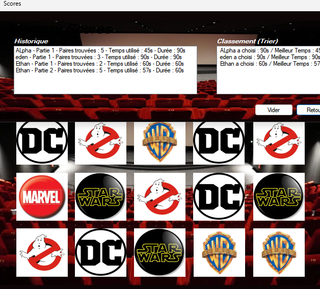

# 🧩 Jeu de Memory

Projet étudiant – SAÉ S2-01 – **BUT1 Informatique**, groupe 108
Réalisé par : **Ethan**, **Tanim Veer**, **Ilan**, **Elyes**

---

## 🚀 Démo

Thème « Cinéma » (logos DC, Ghostbusters, Warner Bros, Marvel, Star Wars), avec l'historique des parties et le classement par meilleur temps :

Le rapport de projet complet (contexte, difficultés rencontrées, tests) est disponible dans [`docs/rapport-projet.docx`](docs/rapport-projet.docx).

---

## 🎯 Description du projet

Jeu de Memory interactif développé en Visual Basic.NET sous Visual Studio. Le joueur clique sur des cartes pour les retourner et former des paires identiques. Le jeu inclut :

- Un timer pour suivre le temps écoulé, avec 3 durées possibles (30, 60 ou 90 secondes)
- Une détection automatique de la fin de partie, avec affichage du résultat
- Une interface redessinée selon le thème choisi (Cinéma ou Fast Food)

## ✅ Fonctionnalités

- **Bouton « Indice »** : révèle temporairement une paire de cartes, limité à 3 utilisations par partie
- **Choix du thème** : Cinéma ou Fast Food, pour varier les parties
- **Bouton « Reset »** : réinitialise la partie sans quitter l'application
- **Bouton « Vider »** : efface les noms et meilleurs scores enregistrés
- **Classement** : scores triés par joueur, avec historique et meilleur temps par durée choisie
- **Pause** : met la partie en pause pour réfléchir
- **Musique** : musique adaptée à chaque écran (menu, jeu)

## 🧠 Difficultés rencontrées et solutions

- **Gestion du retournement des cartes** : limiter le joueur à deux cartes retournées à la fois et bloquer les clics pendant l'animation pour éviter les erreurs → verrouillage temporaire des clics et compteur du nombre de cartes retournées.
- **Placement et actualisation des cartes** : assurer un affichage fluide → positionnement dynamique des cartes en boucle.
- **Coordination des actions** : synchroniser les clics, le timer et l'affichage sans provoquer de bugs → organisation du code autour d'indicateurs d'état partagés (`cartesDevoilees`, `cartesRetournees`, `compteChaine`, voir plus bas).
- **Système de score** : calculer un score cohérent selon la durée choisie → score basé sur le temps total écoulé, adapté à la durée sélectionnée.

## 🧪 Tests et validation

Le jeu a été testé par plusieurs utilisateurs. Points positifs relevés : simplicité de l'interface et clarté du design des cartes. Deux problèmes ont été identifiés et corrigés :

- **Ralentissement du timer** lors du retournement des cartes → timer stabilisé pendant les animations.
- **Indice limité à 2 essais**, jugé insuffisant par les joueurs → passé à 3 essais.

## 🔑 Variables clés (`frmJeu`)

| Variable | Rôle |
|---|---|
| `cartesDevoilees` | Associe chaque carte (`PictureBox`) à son image |
| `cartesRetournees` | Cartes actuellement retournées par le joueur |
| `valeurChaineActuelle`, `compteChaine` | Détectent une série de 4 cartes identiques |
| `nbPairesTrouvees` | Nombre de paires trouvées |
| `indicesUtilises`, `boutonsIndice` | Suivi des indices utilisés |

---

## 🛠️ Technologies

Visual Basic .NET · Windows Forms · Visual Studio

## ▶️ Lancement

> ⚠️ **Le dépôt GitHub ne contient que le code source (`.vb`)**, sans le fichier de solution (`.sln`/`.vbproj`) ni les images et musiques du jeu (`Images/`, `Images2/`, `music/`) : ils n'ont jamais été ajoutés au dépôt à l'origine et n'ont pas pu être retrouvés. Le code n'est donc pas exécutable tel quel en clonant ce dépôt seul.

Pour relancer le projet, il faut :
1. Créer un nouveau projet Windows Forms App (.NET Framework) en VB.NET dans Visual Studio.
2. Ajouter une référence au contrôle ActiveX **Windows Media Player** (`AxWMPLib` / `WMPLib`), utilisé pour la musique.
3. Copier les fichiers `.vb` et `.Designer.vb` de ce dépôt dans le projet, ainsi qu'un dossier `Images/`, `Images2/` (visuels des thèmes) et `music/` (fichiers `.mp3` utilisés).

## 👥 Équipe

- **Tanim Veer** – [@tanim-veer](https://github.com/tanim-veer)
- **Ethan**
- **Ilan**
- **Elyes**
